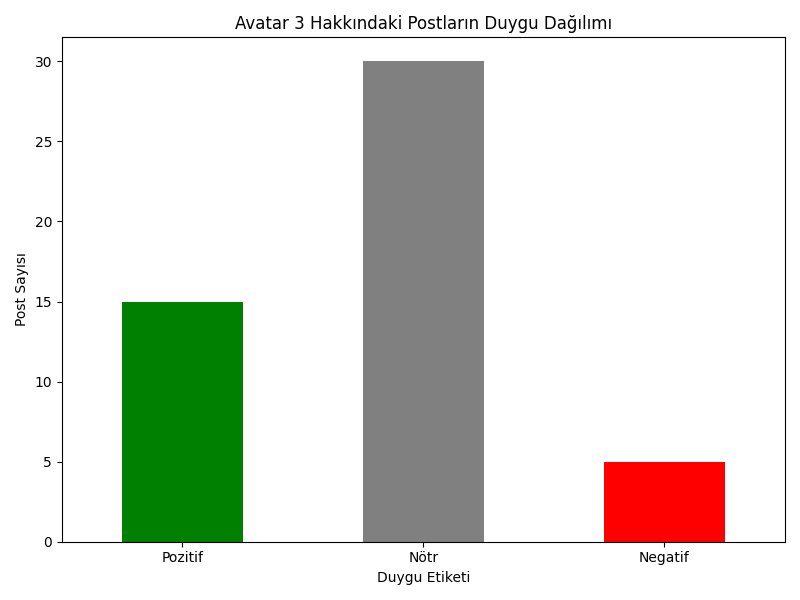

# Avatar 3 Reddit Duygu Analizi Projesi 📊

Bu proje, "Avatar: Fire and Ash" (Avatar 3) filmi hakkındaki Reddit tartışmalarını analiz ederek halkın film hakkındaki genel duygu eğilimini ortaya çıkarmayı amaçlamaktadır. Proje, veri toplama, işleme, duygu analizi ile zenginleştirme ve sonuçları görselleştirme adımlarını içeren baştan sona bir veri mühendisliği sürecini kapsamaktadır.


---

## 🚀 Proje Hakkında

Bu portföy projesi, bir veri mühendisliği yaşam döngüsünün temel adımlarını içerir. Reddit API'si (PRAW) kullanılarak toplanan veriler, `deep-translator` ile İngilizce'ye çevrilmiş, `TextBlob` ile duygu analizi yapılarak zenginleştirilmiş, `pandas` ile analiz edilmiş ve sonuçlar `matplotlib` ile görselleştirilmiştir.

## ✨ Temel Bulgular

* **Genel Duygu Dağılımı:** Toplanan 50 post içinde `Nötr` etiketli başlıklar çoğunluktadır.
* **Etkileşim Analizi:** Ortalama upvote sayısının en yüksek olduğu kategori `Nötr` başlıklardır. Bu, haber niteliğindeki veya spekülatif başlıkların daha fazla ilgi çektiğini gösterebilir.
* **En Popüler Pozitif Başlık:** ``

## 🛠️ Kullanılan Teknolojiler

* Python
* Pandas
* Matplotlib
* PRAW (Python Reddit API Wrapper)
* Deep-Translator
* TextBlob
* Git & GitHub

## ⚙️ Projeyi Yerel Makinede Çalıştırma

Projeyi kendi bilgisayarınızda çalıştırmak için aşağıdaki adımları takip edebilirsiniz.

### Gereksinimler
* Python 3.x
* Git

### Kurulum ve Çalıştırma
1.  Bu depoyu klonlayın:
    ```sh
    git clone [https://github.com/SENIN-KULLANICI-ADIN/reddit-avatar3-analysis.git](https://github.com/SENIN-KULLANICI-ADIN/reddit-avatar3-analysis.git)
    ```
2.  Proje klasörüne gidin:
    ```sh
    cd reddit-avatar3-analysis
    ```
3.  Gerekli kütüphaneleri yükleyin:
    ```sh
    pip install -r requirements.txt
    ```
4.  `config.py` adında bir dosya oluşturun ve içine Reddit API'sinden aldığınız `CLIENT_ID`, `CLIENT_SECRET` ve `USER_AGENT` bilgilerinizi girin.
5.  Script'leri aşağıdaki sırayla çalıştırın:
    ```sh
    py collect_data.py
    py process_data.py
    py analyze_data.py
    ```